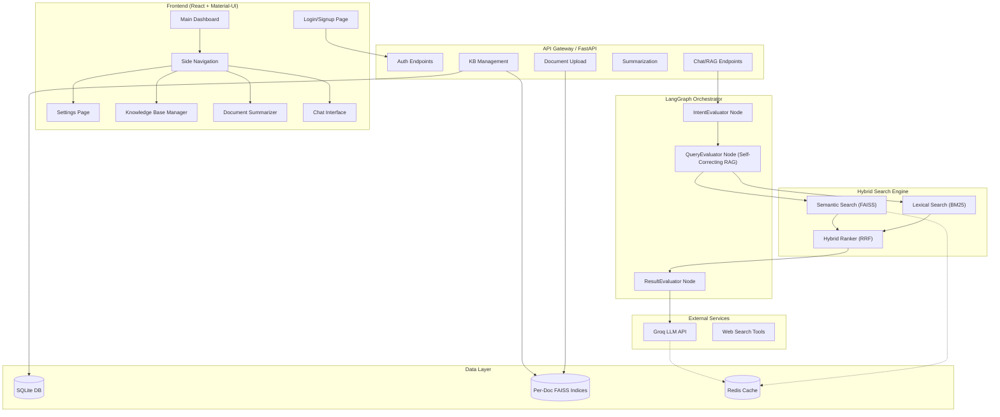
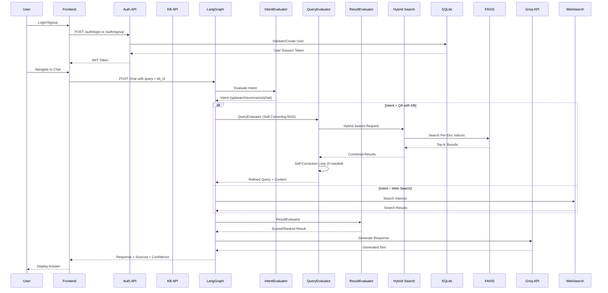

# Enhanced RAG Application - Production Plan

## Executive Summary
A scalable, multi-tenant RAG application with LangGraph-based chat orchestrator, featuring authentication, knowledge base management, document summarization, and intelligent chat with web search capabilities.

---

## 1. System Architecture Diagram



---

## 2. Component & Data Flow Diagram



---

## 3. Data Model Schema

### 3.1 Users
```python
class User(Base):
    id: int (PK)
    username: str (unique, indexed)
    email: str (unique, indexed)
    password_hash: str
    created_at: datetime
    updated_at: datetime
    is_active: bool
```

### 3.2 Sessions (Chat History)
```python
class ChatSession(Base):
    id: int (PK)
    user_id: int (FK -> User)
    title: str
    kb_id: int (FK -> KnowledgeBase, nullable)
    created_at: datetime
    updated_at: datetime
```

### 3.3 Messages
```python
class Message(Base):
    id: int (PK)
    session_id: int (FK -> ChatSession)
    role: str (user/assistant/system)
    content: str
    intent: str (nullable)
    confidence: float (nullable)
    sources: JSON (nullable)
    created_at: datetime
```

### 3.4 Knowledge Bases
```python
class KnowledgeBase(Base):
    id: int (PK)
    user_id: int (FK -> User)
    name: str
    description: str
    is_public: bool
    created_at: datetime
    updated_at: datetime
```

### 3.5 Documents
```python
class Document(Base):
    id: int (PK)
    kb_id: int (FK -> KnowledgeBase)
    user_id: int (FK -> User)
    title: str
    content: str (full text)
    file_type: str (pdf/docx/txt)
    file_path: str
    chunk_count: int
    indexed: bool
    created_at: datetime
```

### 3.6 Document Indices (Per-Document FAISS)
```python
class DocumentIndex(Base):
    id: int (PK)
    document_id: int (FK -> Document)
    faiss_index_path: str
    bm25_index_path: str
    embedding_model: str
    dimension: int
    chunk_size: int
    index_status: str (pending/building/ready/error)
    created_at: datetime
```

---

## 4. API Contracts

### 4.1 Authentication
```
POST /auth/signup
Input:  { "username": str, "email": str, "password": str }
Output: { "user_id": int, "token": str }
Errors: 400 (user exists), 422 (validation error)

POST /auth/login
Input:  { "username": str, "password": str }
Output: { "user_id": int, "token": str }
Errors: 401 (invalid credentials)
```

### 4.2 Knowledge Base
```
GET /api/kb
Output: { "kbs": [{ "id": int, "name": str, "description": str }] }

POST /api/kb
Input:  { "name": str, "description": str }
Output: { "id": int, "name": str }
Errors: 401 (unauthorized), 422 (validation error)

DELETE /api/kb/{kb_id}
Output: { "status": "deleted" }
Errors: 404 (not found), 401 (unauthorized)
```

### 4.3 Document Upload
```
POST /api/kb/{kb_id}/documents
Input:  { "file": Binary, "title": str }
Output: { "id": int, "title": str, "status": "indexing" }
Errors: 401, 413 (file too large), 415 (unsupported type)

GET /api/documents/{doc_id}/status
Output: { "status": str, "chunk_count": int }
```

### 4.4 Index Management
```
POST /api/documents/{doc_id}/index
Output: { "status": "indexing" }

DELETE /api/documents/{doc_id}/index
Output: { "status": "deleted" }
```

### 4.5 Summarization
```
POST /api/summarize
Input:  { "document_id": int } OR { "text": str }
Output: { "summary": str, "key_points": [str] }
Errors: 401, 404 (document not found)

POST /api/summarize/file
Input:  { "file": Binary }
Output: { "summary": str }
```

### 4.6 Chat/RAG Query
```
POST /api/chat
Input:  { 
    "message": str, 
    "session_id": int (optional),
    "kb_id": int (optional),
    "use_web_search": bool (default: false)
}
Output: { 
    "answer": str, 
    "confidence": float,
    "sources": [{ "doc_id": int, "text": str, "score": float }],
    "intent": str,
    "session_id": int
}
Errors: 401, 400 (no kb selected for RAG)

POST /api/chat/stream
Input:  Same as /chat
Output: Server-Sent Events with tokens
```

---

## 5. LangGraph Node Specifications

### 5.1 IntentEvaluator Node
```python
class IntentEvaluatorNode:
    """
    Determines user intent from query.
    Outputs: intent (qa|search|summarize|chat|general)
    """
    def evaluate(self, query: str) -> IntentResult:
        # Use LLM to classify intent
        # Fallback: rule-based keyword matching
        return IntentResult(
            intent="qa" if any(kw in query for kw in ["what", "how", "why", "explain"]) else
                   "search" if any(kw in query for kw in ["find", "search", "look up"]) else
                   "summarize" if "summarize" in query else "chat"
        )
```

### 5.2 QueryEvaluator Node (Self-Correcting RAG)
```python
class QueryEvaluatorNode:
    """
    Refines and reformulates user query for optimal retrieval.
    Includes self-correction loop.
    """
    def evaluate(self, query: str, kb_context: dict) -> QueryResult:
        # Step 1: Query decomposition
        # Step 2: Expand with synonyms
        # Step 3: Self-correction validation
        for attempt in range(3):
            refined = self.refine_query(query, kb_context)
            if self.validate_query(refined):
                break
        return QueryResult(refined_query=refined, original=query)
    
    def validate_query(self, query: str) -> bool:
        # Check for hallucinated entities
        # Check for answerable questions
        return True
```

### 5.3 ResultEvaluator Node
```python
class ResultEvaluatorNode:
    """
    Validates and scores final results.
    """
    def evaluate(self, results: list, answer: str) -> EvaluationResult:
        confidence = self.calculate_confidence(results, answer)
        relevance = self.check_relevance(answer, results)
        return EvaluationResult(
            confidence=confidence,
            relevance=relevance,
            is_valid=confidence > 0.5 and relevance > 0.3,
            needs_correction=confidence < 0.5
        )
```

---

## 6. Hybrid Search Strategy

### 6.1 Per-Document FAISS Index
- Each document gets its own FAISS index file
- Index stored at: `data_storage/indices/{doc_id}/faiss.index`
- BM25 index at: `data_storage/indices/{doc_id}/bm25.pkl`

### 6.2 Dynamic Search Across All Indices
```python
class DynamicSearchEngine:
    def search(self, query: str, kb_id: int, top_k: int = 5):
        # 1. Get all document IDs for KB
        docs = self.get_kb_documents(kb_id)
        
        # 2. Search each document index in parallel
        results = []
        with ThreadPoolExecutor(max_workers=10) as executor:
            futures = [executor.submit(self.search_doc, doc_id, query) for doc_id in docs]
            for future in futures:
                results.extend(future.result())
        
        # 3. RRF Fusion
        return self.rrf_fusion(results, top_k)
```

### 6.3 Reciprocal Rank Fusion
```python
def rrf_fusion(results: list, k: int = 60):
    scores = {}
    for result in results:
        doc_id = result["doc_id"]
        rank = result["rank"]
        scores[doc_id] = scores.get(doc_id, 0) + 1 / (k + rank)
    return sorted(scores.items(), key=lambda x: x[1], reverse=True)[:top_k]
```

---

## 7. Non-Functional Requirements

### 7.1 Latency Targets (SLAs)
| Action | Target Latency | 99th Percentile |
|--------|---------------|-----------------|
| Login/Signup | < 500ms | < 2s |
| Document Upload | < 5s | < 15s |
| Index Build | < 30s per MB | < 60s per MB |
| Search | < 1s | < 3s |
| Chat Response | < 3s | < 10s |
| Summarization | < 10s | < 30s |

### 7.2 Throughput Targets
- Target: 1M concurrent users
- Requests per second: 10,000 RPS (peak)
- Indexing throughput: 100 documents/second

### 7.3 Caching Strategy
- **Cache Layer**: Redis
- **Cache Rules**:
  - Query embeddings: 24 hours
  - Search results (semantic): 1 hour
  - User sessions: 7 days
  - KB metadata: 1 hour
- **Invalidation**:
  - On new document upload to KB
  - On document delete
  - On KB settings change

### 7.4 Rate Limiting
- Auth endpoints: 5 requests/minute
- Chat endpoints: 30 requests/minute
- Document upload: 10 requests/minute

### 7.5 Multi-Tenant Isolation
- Row-level security in SQLite
- Per-tenant FAISS index directories
- Separate cache namespaces per user

### 7.6 Monitoring & Observability
- Metrics: request latency, error rate, cache hit rate
- Traces: LangGraph node execution times
- Logs: All API requests with correlation IDs
- Alerts: High latency, low confidence, index failures

---

## 8. Implementation Phases

### Phase 1: Foundation (Week 1-2)
- [ ] Setup project structure
- [ ] Implement authentication (JWT)
- [ ] Create database schema
- [ ] Basic API endpoints

### Phase 2: Core RAG (Week 3-4)
- [ ] LangGraph orchestrator setup
- [ ] IntentEvaluator node
- [ ] QueryEvaluator node
- [ ] ResultEvaluator node

### Phase 3: Search Engine (Week 5-6)
- [ ] Per-document FAISS indices
- [ ] BM25 implementation
- [ ] Hybrid ranker (RRF)
- [ ] Dynamic multi-index search

### Phase 4: Features (Week 7-8)
- [ ] Knowledge Base management UI
- [ ] Document upload & indexing
- [ ] Summarization feature
- [ ] Web search integration

### Phase 5: Frontend (Week 9-10)
- [ ] Login/Signup pages
- [ ] Dashboard with sidebar
- [ ] Settings (API key)
- [ ] Knowledge Base UI
- [ ] Summarizer UI
- [ ] Chat UI with KB dropdown

### Phase 6: Optimization (Week 11-12)
- [ ] Redis caching
- [ ] Rate limiting
- [ ] Performance tuning
- [ ] Load testing

---

## 9. Technology Stack

| Component | Technology | Rationale |
|-----------|-----------|-----------|
| Frontend | React 18 + Material-UI | Modern, responsive, component library |
| Backend | FastAPI | Async, auto-docs, Python native |
| Database | SQLite (SQLAlchemy) | Simple, portable, ACID compliant |
| Vector Store | FAISS (per-document) | Fast similarity search |
| Lexical Search | BM25 (rank-bm25) | Proven keyword search |
| LLM | Groq (Llama 3) | Fast inference, free tier |
| Embeddings | Sentence Transformers | High quality, open source |
| Orchestration | LangGraph | State management, node orchestration |
| Caching | Redis | In-memory, TTL support |
| Auth | JWT | Stateless, scalable |

---

## 10. Acceptance Criteria

### Authentication
- [ ] User can signup with username/email/password
- [ ] User can login and receive JWT token
- [ ] Protected routes require valid token

### Knowledge Base
- [ ] User can create KB with name/description
- [ ] User can view list of their KBs
- [ ] User can delete KB (cascades to documents)

### Document Management
- [ ] User can upload PDF, DOCX, TXT files
- [ ] Documents are chunked and indexed
- [ ] Per-document FAISS index is created
- [ ] User can view document status

### Summarization
- [ ] User can upload document for summarization
- [ ] System returns summary + key points
- [ ] Works with raw text input

### Chat
- [ ] User can select KB from dropdown
- [ ] Without KB: uses web search
- [ ] With KB: uses RAG pipeline
- [ ] Shows confidence score
- [ ] Shows sources with citations
- [ ] Intent is evaluated and logged

### LangGraph Nodes
- [ ] IntentEvaluator classifies query type
- [ ] QueryEvaluator refines query (self-correcting)
- [ ] ResultEvaluator scores final answer

### Performance
- [ ] Search returns in < 1s
- [ ] Chat response in < 3s
- [ ] Caching improves repeat queries

---

## 11. Scalability Plan

### Horizontal Scaling
- Stateless API servers behind load balancer
- Redis cache shared across instances
- FAISS indices served from shared storage

### Vertical Scaling
- Increase worker threads for indexing
- Batch document processing
- Async pipeline for embeddings

### Data Partitioning
- Per-user database directories
- Per-document index files
- sharded FAISS for very large KBs
