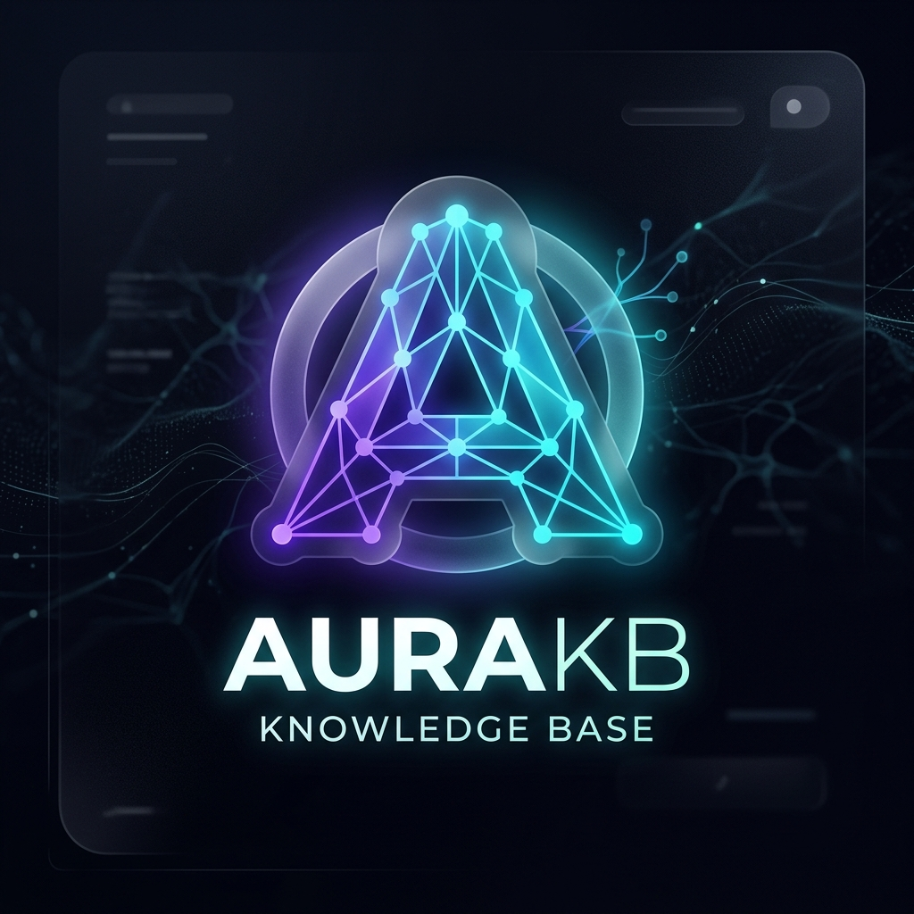
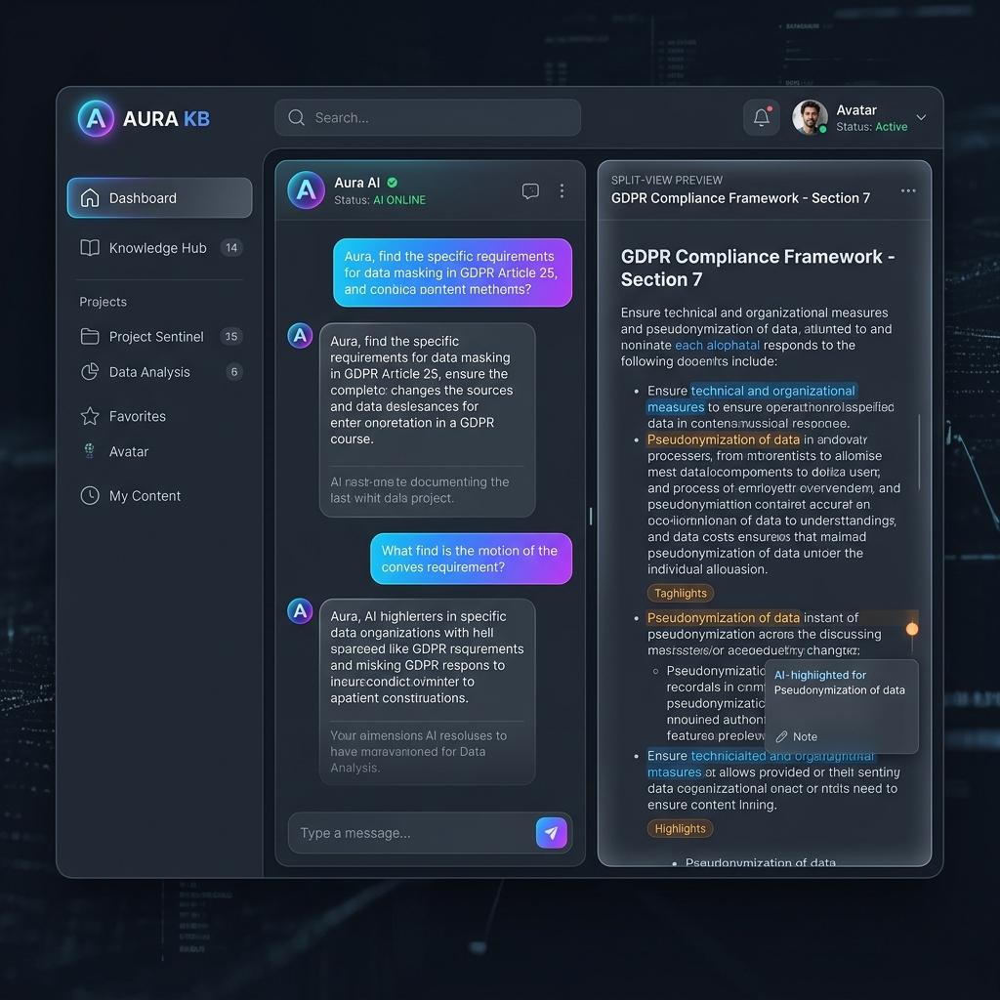

# AuraKB: UI/UX Enhancement Proposal

Based on the latest trends in AI and RAG applications, here is the vision for the future of your Knowledge Base system.

## 🏷️ Brand Identity: AuraKB
The name **AuraKB** represents a seamless "atmosphere" of intelligence. It transitions the app from a technical tool to a premium Knowledge Operating System.

### 🎨 Logo Concept
The logo represents interconnected neural pathways forming a stable, geometric foundation.

## ✨ Visual Excellence & Experience
The new UI focuses on **Transparency, Adaptability, and Depth**.

### 1. Glassmorphism & Obsidian Dark Mode
Moving away from flat designs to a layered, frosted-glass aesthetic. Using deep obsidian and slate tones ensures the interface feels premium and is easy on the eyes during long research sessions.

### 2. Generative & Adaptive UI
The interface shouldn't just be a chat box. It should adapt to the content:
- **Interactive Tables**: Automatically rendered when comparing data from multiple documents.
- **Side-by-Side Preview**: A seamless 50/50 split that appears when you click a citation.

### 3. Latency Mastery
Using smooth micro-animations and progressive streaming to make the "Retrieval + Reranking" process feel like a cinematic experience rather than a "waiting" state.

## 🚀 Next Steps
1.  **Design System**: Create a unified set of tokens for colors, glass effects, and typography.
2.  **Split-View Engine**: Build the layout component that handles the dynamic panel transitions.
3.  **Command Palette**: Implement the `Ctrl + K` global navigation system.
